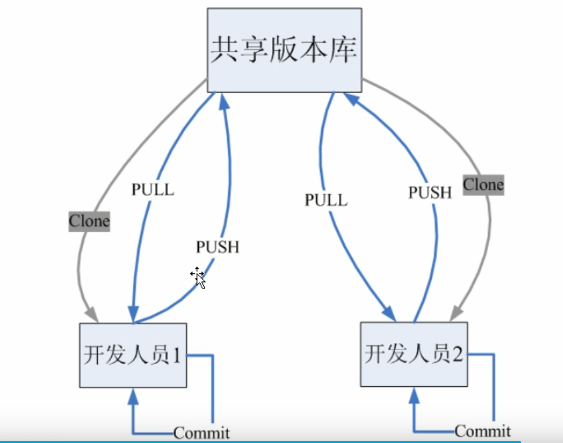

## Git是什么？
* Git 是一个开源的分布式版本控制系统，用于敏捷高效地处理任何或小或大的项目。
* Git 是 Linus Torvalds 为了帮助管理 Linux 内核开发而开发的一个开放源码的版本控制软件。
* Git 与常用的版本控制工具 CVS, Subversion 等不同，它采用了分布式版本库的方式，不必服务器端软件支持。
## Git和svn对比
### svn
svn是集中式版本控制系统，版本库是集中在中央服务器的，干活的时候，用的都是自己的电脑，需要从中央服务器获取到最新版本，然后干活，干完活后，需要把自己做完的活推送到中央服务器，集中式版本控制系统必须联网才能工作。如果想要用svn，就得先装一个服务器，在这个服务器上装一个svn服务，然后在开发的机器上装一个svn的客户端。

**优点**：
集中管理方式在一定程度上看到其他开发人员在干什么，管理员也可以很轻松掌握每一个人的开发权限，
**缺点**:
* 服务器单点故障
* 容错性差
### Git
git是分布式版本控制系统，是没有中央服务器的，每一个人的电脑就是一个版本库，这样，工作的时候就不用联网了，既然每个人的电脑都是一个完整版本库，那么如果多人协作呢？比如自己修改了文件A，其他人也在电脑上修改了文件A，这时，只需要把各自的修改推送给对方，就可以互相看到对方的修改了。

**git工作流程**
一般工作流程：
* 从远程仓库中克隆Git资源作为本地仓库
* 从本地仓库进行checkout代码然后进行代码修改
* 在提交前先将代码提交至暂存区
* 提交修改，提交到本地仓库。本地仓库中保存修改的各个历史版本，
* 在修改完成后，需要和团队进行代码共享时，可以将代码push到远程仓库。

#### 基本概念
git中有工作区，暂存区以及版本库的概念，这三个分别都是什么呢？
**工作区**
这是我们电脑上能看到的目录。
比如我用的vscode，左侧的资源管理器看到的目录就是git中的工作区。
**暂存区**
英文叫stage，或index。一般存放在'.git目录下'的index文件(`.git/index`)中，所以暂存区有时也叫索引(index)。
**版本库**
工作区中有一个隐藏目录.git，这个不算工作区，而是git的版本库。
下图是工作区、暂存区和版本库的关系图：

图中左侧为工作区，右侧为版本库。在版本库中标记为 "index" 的区域是暂存区（stage, index），标记为 "master" 的是 master 分支所代表的目录树。
此时 "HEAD" 实际是指向 master 分支的一个"游标"。所以图示的命令中出现 HEAD 的地方可以用 master 来替换。
图中的objects标识的区域为git中的一个对象库，实际位于`.git/objects`目录下,里面包含了创建的各种对象及内容。
* 当对工作区修改（或新增）的文件执行`git add `命令时，暂存区的目录树会被更新，同时工作区修改（或新增）的文件内容被写入到对象库中的一个新的对象中，而该对象的ID被记录在暂存区的索引中。
修复问题hotfix